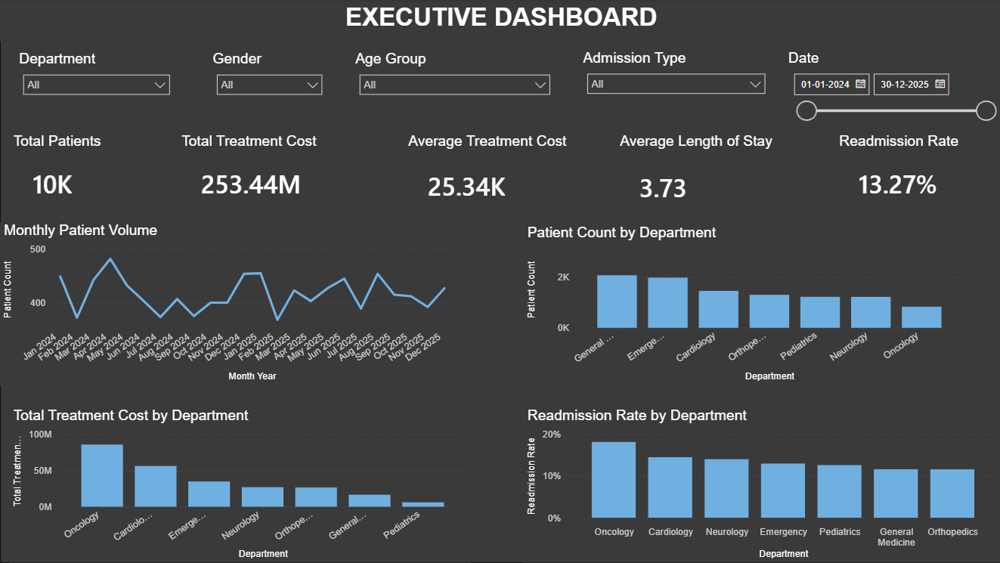

# 🏥 Healthcare Patient Analytics Dashboard

### Power BI | Power Query | DAX | Excel

An end-to-end **Healthcare Patient Analytics** project built in Microsoft Power BI to analyze patient volume, treatment costs, department performance, length of stay, patient satisfaction, outcomes, and readmissions.

---

## 📊 Dashboard Preview



The dashboard provides an interactive view of hospital performance and allows users to analyze the data using filters, KPIs, charts, and patient-level drill-through.

---

# 🎯 Project Objective

The objective of this project was to transform raw healthcare data into an interactive business intelligence dashboard that can help hospital management:

- Monitor patient volume
- Analyze department performance
- Track treatment costs
- Understand patient demographics
- Monitor length of stay
- Analyze patient satisfaction
- Identify readmission patterns
- Evaluate patient outcomes
- Identify areas requiring management attention

---

# 📌 Key KPIs

| KPI | Result |
|---|---:|
| Total Patients | **10,000** |
| Total Treatment Cost | **₹25.34 Crore** |
| Average Treatment Cost | **₹25.34K** |
| Average Length of Stay | **3.73 Days** |
| Readmission Rate | **13.27%** |

---

# 🛠️ Tools Used

- **Power BI** – Dashboard development and visualization
- **Power Query** – Data cleaning and transformation
- **DAX** – Measures and KPI calculations
- **Microsoft Excel** – Source dataset

---

# 🔄 Data Analysis Process

The project followed an end-to-end Data Analyst workflow:

**Raw Data → Data Cleaning → Data Transformation → Data Modeling → DAX → Visualization → Business Insights**

### Data Preparation

Using Power Query, I:

- Checked data quality
- Identified and removed duplicate patient records
- Handled missing values
- Corrected data types
- Converted date/time values into proper dates
- Created Age Group categories
- Created Stay Category classifications

### Data Modeling

A dedicated Date Table was created and connected to the healthcare data using the Admission Date.

### DAX Analysis

DAX measures were created to calculate:

- Total Patients
- Total Admissions
- Total Treatment Cost
- Average Treatment Cost
- Average Length of Stay
- Readmission Rate
- Recovery Rate
- Average Patient Satisfaction
- Cost Per Patient
- Short, Medium and Long Stay Patients

---

# 📊 Dashboard

The Power BI report contains **6 analytical pages**, each designed for a specific business purpose.

---

## 1. Executive Dashboard

Provides a high-level overview of hospital performance.

### Includes:

- Total Patients
- Total Treatment Cost
- Average Treatment Cost
- Average Length of Stay
- Readmission Rate
- Monthly Patient Volume
- Patients by Department
- Treatment Cost by Department
- Readmission Rate by Department

Interactive filters allow users to analyze the dashboard by department, admission type, gender, age group, and date.


---

## 2. Patient & Demographic Analysis

Focuses on patient demographics and admission patterns.

### Analysis includes:

- Patients by Gender
- Patients by Age Group
- Patients by Admission Type
- Patients by Insurance Type
- Department & Admission Type
- Age Group & Gender


---

## 3. Department Performance

Compares healthcare departments across operational and patient-related metrics.

### Analysis includes:

- Patient Count by Department
- Average Length of Stay
- Average Treatment Cost
- Readmission Rate
- Patient Satisfaction
- Total Treatment Cost


---

## 4. Financial & Treatment Analysis

Focuses on the financial performance of treatments and departments.

### Analysis includes:

- Total Treatment Cost by Department
- Average Treatment Cost by Department
- Treatment Cost by Treatment
- Treatment Cost by Insurance Type
- Treatment Cost by Payment Method
- Cost Per Patient by Department


---

## 5. Outcomes & Readmission Analysis

Analyzes patient outcomes, satisfaction, and readmission behavior.

### Analysis includes:

- Patient Outcome Distribution
- Readmission Distribution
- Readmission Rate by Department
- Average Length of Stay by Outcome
- Patient Satisfaction by Outcome
- Readmission Rate by Age Group


---

## 6. Patient Details

Provides detailed patient-level information through Power BI Drill-through.

### Features:

- Patient ID search
- Patient-level records
- Treatment information
- Admission and discharge details
- Treatment cost
- Length of stay
- Patient satisfaction
- Outcome
- Readmission status
- Drill-through navigation


---

# 🔍 Key Business Insights

### 👥 General Medicine had the highest patient volume

General Medicine recorded **2,055 patients**, making it the highest-volume department.

This indicates that resource allocation, staffing, and capacity planning should be closely monitored in this department.

### 💰 Oncology had the highest treatment cost

Oncology recorded approximately **₹8.59 crore** in total treatment costs, making it the largest contributor to overall treatment expenditure.

### 🏥 Oncology had the highest average length of stay

Oncology recorded an average length of stay of **7.13 days**, significantly higher than the overall hospital average of **3.73 days**.

### 🔄 Oncology had the highest readmission rate

Oncology recorded a readmission rate of **18.18%**, compared with the overall hospital rate of **13.27%**.

This makes Oncology an important area for further investigation.

### ⭐ Neurology had the highest patient satisfaction

Neurology recorded the highest average patient satisfaction score at **3.98/5**.

This may provide useful practices that could be studied for improving patient experience across other departments.

---

# 🎯 Key Finding

The strongest pattern identified in the analysis was:

> **Oncology had the highest treatment cost, highest average length of stay, and highest readmission rate.**

This suggests that Oncology should be investigated further to understand:

- Treatment complexity
- Resource utilization
- Longer hospital stays
- Discharge planning
- Post-treatment follow-up
- Factors contributing to readmissions

---

# 💡 Business Recommendations

Based on the analysis:

- Review staffing and resource allocation in high-volume departments.
- Investigate major cost drivers within Oncology.
- Analyze reasons for longer stays and identify opportunities to improve discharge efficiency.
- Investigate the causes of Oncology readmissions.
- Strengthen post-treatment follow-up and discharge planning where appropriate.
- Study practices associated with higher patient satisfaction and identify opportunities to apply them across other departments.

---

# 📂 Project Structure

```text
healthcare-patient-analytics-powerbi/
│
├── README.md
│
├── PowerBI/
│   └── Healthcare_Patient_Analytics.pbix
│
├── Dataset/
│   └── Healthcare_Patient_Analytics_Project.xlsx
│
├── Screenshots/
│   ├── Executive_Dashboard.png
│   ├── Patient_Demographic_Analysis.png
│   ├── Department_Performance.png
│   ├── Financial_Treatment_Analysis.png
│   ├── Outcomes_Readmission_Analysis.png
│   └── Patient_Details.png
│
└── Documentation/
    └── Project_Insights.md
